# FutureNet — Web UI Demo
*A minimal-distraction kid-friendly mobile interface prototype for a safer digital future.*

FutureNet is a web-based prototype of a mobile launcher UI designed for children in primary school.  
The purpose of this demo is to **visualize the UI/UX direction**, validate interaction concepts, and present ideas to collaborators, parents, educators, and potential partners **before building hardware or Android apps**.

This project is part of the larger vision to build a **digital village (kampung)** for children — a safe environment that promotes responsible technological growth.


---

## 🌱 Project Vision
FutureNet imagines a world where children use technology safely, free from the commercial pressures and distractions of the modern internet.  

From our user discovery so far, we understand that the demographic of children and their digital needs varies drastically across age groups:

### Little Link: Ages 5–8
- Bright colours  
- Large icons  
- Simple navigation  
- Low distraction environment  
- Restricted communication with just parents/family for when kids are out

### Later Link: Ages 9–12
- Mimics simplified adult smartphone UX responsibly  
- Social creativity, messaging (with friends), and productivity

### Teen Link: Ages 13-16
- Focus on safe gateway to internet
- Research on what safe social media use looks like
- Wider social and entertainment needs
- Gaming needs
- Require access to more internet-facing tools

> *Most children start forming digital habits very early; FutureNet aims to establish healthy foundations from day one.*

### Little Link
FutureNet intends to later on branch into two age-appropriate variants, but first focusing on the 5-8 year old age group as a base.

Inspired by [**Japan’s keitai phones for kids**](https://www.red-dot.org/project/kids-keitai-46228), FutureNet explores:

- A **minimal-distraction interface**
- **Whitelisted communication** with trusted contacts
- A **private network separate from the public internet**
- Tools for learning, independence, and digital wellbeing
- Community-driven development

This repo contains the **Web UI Demo** for these prototypes.

---

## � Roadmap (Dec 2025 → Jan 2027)

FutureNet follows a phased roadmap to move from early research to real-world pilots and hardware-supported launch.

The full Gannt chart lives in: [docs/roadmap/littlelink-roadmap.md](docs/roadmap/littlelink-roadmap.md).

```mermaid
flowchart TB
  classDef research fill:#DCEFC8,stroke:#6FA85B,color:#000;
  classDef prototype fill:#FFE5C0,stroke:#F2A65A,color:#000;
  classDef development fill:#D0E6FF,stroke:#4A90E2,color:#000;
  classDef pilot fill:#E6D7FF,stroke:#9B59B6,color:#000;
  classDef refine fill:#FAD4D8,stroke:#E57373,color:#000;
  classDef launch fill:#FFF3C2,stroke:#D4A017,color:#000;
  classDef fulfil fill:#E0E0E0,stroke:#757575,color:#000;

  subgraph timeline["LittleLink Roadmap: Dec 2025 → Jan 2027
  "]
  
    direction TB
    R1["🔎 Research & Discovery Dec 2025 — Feb 2026
    User discovery, interviews (15–20 parents, 8–10 teachers)"]:::research
    P1["🌐 Web UI Prototype
    Feb — Mar 2026
    Clickable demo"]:::prototype
    T1["🧪 Usability Testing
    Apr 2026
    20–30 sessions"]:::prototype
    D1["📱 Development
    May — Jul 2026
    Android launcher, Parent app
    Hardware discovery"]:::development
    PIL["🏫 Pilot
    Jul 2026
    30–50 families (SG / AU)"]:::pilot
    H1["🔧 Refinement & Hardware
    Aug 2026
    Launcher v2 + hardware prototype"]:::refine
    K1["🚀 Kickstarter
    Sep — Dec 2026
    Holiday campaign"]:::launch
    F1["📦 Fulfilment
    Dec 2026 — Jan 2027
    Manufacturing & shipping"]:::fulfil
  end

  R1 --> P1 --> T1 --> D1 --> PIL --> H1 --> K1 --> F1
```



**Phase overview:**

- **Research & Discovery (Dec 2025 — Feb 2026)**  
  Deep user discovery and market research, including interviews with parents, teachers, psychologists and regulators. Early brand and community-building (social, newsletter) runs throughout this period.

- **Prototype (Feb — Apr 2026)**  
  Build the web UI prototype (this repo) and run focused usability testing sessions with families to validate interaction patterns, content hierarchy, and the overall value proposition.

- **Development (May — Jul 2026)**  
  Implement the Android launcher MVP, a companion parent app, and explore hardware options. This also includes a potential secondhand Android phone donation program to support lower-income families.

- **Pilot (Jul 2026)**  
  Run a small-scale pilot with ~30–50 families (initially SG / AU, potentially others) to test real-world daily use, parental workflows, and school fit.

- **Refinement & Hardware (Aug 2026)**  
  Iterate on launcher v2 based on pilot feedback, prototype hardware, and validate the bill of materials (BOM) for manufacturing.

- **Launch (Sep — Dec 2026)**  
  Prepare and run a Kickstarter campaign (aligned to the holiday season) to fund initial production and expand the community.

- **Fulfilment (Dec 2026 — Jan 2027)**  
  Manufacture, ship, and support the first batch of devices and deployment kits for early backers and pilot partners.

---

## �📱 Core App Concepts (Example placeholders)
- Messaging with parental controls
- Location sharing / tracking
- SOS button
- Safe browser (content filtering, whitelist)
- Note taking & homework reminders
- Maps / navigation
- Access to MOE learning tools
- Lightweight supervised payment
- Responsible AI tool for research

---

## 🛠 Tech Stack
| Component | Technology |
|------------|------------|
| Framework | React/Next.js |
| Styling | TailwindCSS |
| Deployment | Vercel / Netlify |
| State | Minimal / local only (demo focus) |

**Future plan:** Android launcher in **Kotlin + Jetpack Compose** once UX stabilizes.

---

## 🎯 Goals of the Web Demo
- Explore layout, interaction patterns, colour systems, icon scale
- Validate design assumptions across age groups
- Support usability input from parents and educators
- Prototype concepts quickly and affordably in a sharable format
- Provide a visual basis for pitching and recruiting contributors

> ⚠ This demo is UI-only — no real messaging, networking, or OS features are implemented yet.


---

## 📁 Project Structure

This is a [Next.js](https://nextjs.org) project bootstrapped with [`create-next-app`](https://nextjs.org/docs/app/api-reference/cli/create-next-app).

## Getting Started

First, install the necessary dependencies:
```bash
npm install
# or
yarn install
# or
pnpm install
# or
bun install
``` 

Then, run the development server:

```bash
npm run dev
# or
yarn dev
# or
pnpm dev
# or
bun dev
```

Open [http://localhost:3000](http://localhost:3000) with your browser to see the result.

You can start editing the page by modifying `app/page.tsx`. The page auto-updates as you edit the file.

This project uses [`next/font`](https://nextjs.org/docs/app/building-your-application/optimizing/fonts) to automatically optimize and load [Geist](https://vercel.com/font), a new font family for Vercel.

## 📁 Project Resources

For easier navigation, here are links to the main project folders and documentation:

| Area | Description | Link |
|------|-------------|------|
| **Research** | All research documentation | [docs/research](docs/research) |
| **Stakeholder Research** | Notes, templates, and insights from interviews with parents, teachers, students, and experts. | [docs/research/stakeholders/README.md](docs/research/stakeholders/README.md) |
| **User Persona Research** | Template for user persona. | [docs/research/user-personas/user-persona-[name].md](docs/research/user-personas/user-persona-[name].md) |
| **Design** | All design documentation | [docs/design]docs/design) |
| **Wireframes (Low-Fidelity)** | PlantUML/SALT wireframes. | [docs/design/wireframes/low-fidelity/README.md](docs/design/wireframes/low-fidelity/README.md) |

> Tip: Always refer to the relevant README in each folder for detailed instructions and workflow.

---

## 🤝 Contributing

If you’d like to contribute (including as a non-coder or first-time contributor), please see:

- [CONTRIBUTING.md](CONTRIBUTING.md)

This guide walks through setting up your environment, cloning the repo, running the app locally, and opening your first pull request with links to official GitHub documentation.

## 🖥️ Pitch Deck (Quick Start)

Follow the setup instructions in the [CONTRIBUTING.md](CONTRIBUTING.md) guide. 

- **Run the pitch deck**:

  ```bash
  npm run pitch
  ```

  This will open the FutureNet pitch deck in your browser.

- **Full, non‑technical guide** (how to edit slides, export PDF, and print):  
  See [`presentations/futurenet-pitch/README.md`](presentations/futurenet-pitch/README.md).
