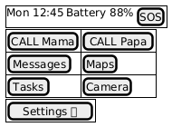
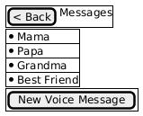
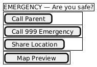
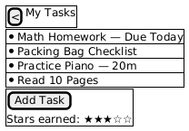
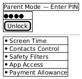

# 🖼 Futurenet Wireframes

This folder contains low-fidelity wireframes for **Futurenet / LittleLink / LaterLink** — designed for children aged 5–12.  
Wireframes are created in **PlantUML (SALT syntax)** and exported as PNGs for easier viewing.

---

## 📂 Exported Wireframes

| Screen | Preview |
|--------|---------|
| HOME |  |
| Messaging |  |
| Emergency / SOS |  |
| Tasks |  |
| Parent mode | 

---

## 🛠 How to Edit Wireframes

Wireframes are maintained in `.puml` files. To edit:

1. Open the `.puml` file in **VSCode** with the [PlantUML extension](https://marketplace.visualstudio.com/items?itemName=jebbs.plantuml)
2. Preview changes in real-time
3. Export PNGs for sharing using the command palette: `PlantUML: Export Current Diagram`
4. They will be available in the `/out` directory at the root of your folder. Move these images into the `png` folder.

# 📐 Using PlantUML for Wireframes & Diagrams

This project uses **PlantUML** and its **SALT UI wireframing syntax** to create low-fidelity wireframes for Futurenet / LittleLink / LaterLink.  
Diagrams are stored as `.puml` files in the `/docs/wireframes/` folder.

PlantUML lets us version-control wireframes as code, making collaboration easier without Figma dependencies.

---

## 🛠 How to View & Edit PlantUML Diagrams

### Option 1 — VSCode Extension (recommended)
1. Install **Visual Studio Code** (if you don’t have it).
2. Install the **PlantUML extension** from the marketplace:
   - Search: `PlantUML` (by jebbs)
3. Open the extension settings, set render option to PlantUMLServer, and under PlantUML: Server insert `https://www.plantuml.com/plantuml`.
4. If not working, you might need to install **Graphviz** (required for diagram rendering):
   - macOS (Homebrew):
     ```bash
     brew install graphviz
     ```
   - Ubuntu / Debian:
     ```bash
     sudo apt install graphviz
     ```
   - Windows (Chocolatey):
     ```bash
     choco install graphviz
     ```
4. Open a `.puml` file in VSCode.
5. Press `ALT + D` to open the preview window.

---

### Option 2 — Use the PlantUML Live Server
No local installation needed:  
🔗 [https://www.plantuml.com/plantuml](https://www.plantuml.com/plantuml)

Steps:
1. Open the website
2. Paste your `.puml` file content
3. Preview updates instantly

---

### Option 3 — Run a Local PlantUML Server
Allows real-time rendering and PNG/SVG export:

```bash
docker run -d -p 8080:8080 plantuml/plantuml-server:jetty
