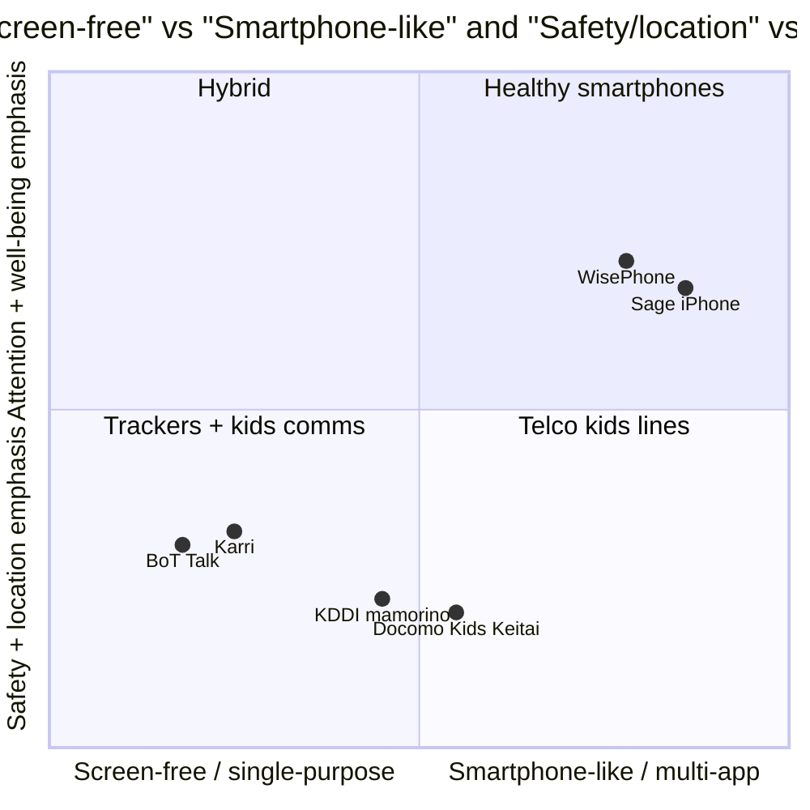
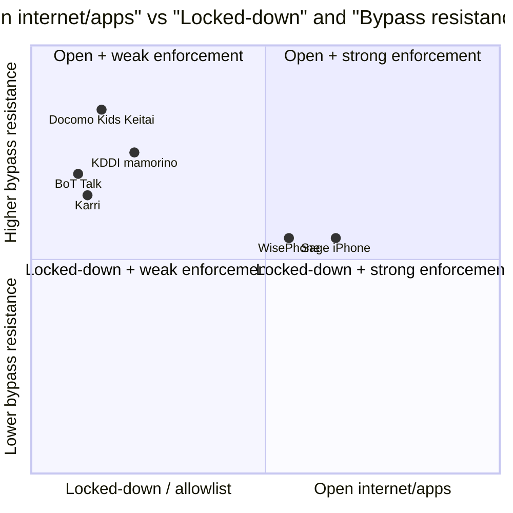

# Competitor analysis: child communication + safety devices (cross-region)

This document synthesizes competitor devices researched in `docs/research/market-research/`:

- Japan: **KDDI mamorino watch**, **NTT Docomo Kids Keitai (KY-41C / SK-41D)**
- UK: **Karri Messenger**, **Sage Mobile (Sage iPhone)**
- US: **BoT Talk**, **WisePhone (Techless)**

It also maps **unfilled gaps** against discovery interview pain points in:
`docs/research/stakeholders/summary/pain-points-and-potential-features.md`.

---

## 1) Competitive landscape (at-a-glance)

### 1.1 Device categories (what exists)

- **Telco-integrated kids phone / watch (Japan)**
  - Carrier plan, network-level restrictions, whitelisted calling/messaging, GPS services.
- **Screen-free comms + GPS trackers (UK/US)**
  - Push-to-talk voice messaging; limited interactions; companion parent app.
- **“Healthy smartphone” (UK/US)**
  - Smartphone hardware with a restricted OS/curated app list, subscription for enforcement.

### 1.2 Mermaid map: ecosystem clusters

```mermaid
flowchart TB
  A[Kids Safety + Communication Market] --> J[Japan: Telco-integrated kids lines]
  A --> W[West UK-US: DTC subscription devices]
  A --> T[West UK-US: Screen-free GPS + voice]

  J --> J1[KDDI mamorino watch\n- voice call + SMS\n- preset contacts\n- GPS + distance alarm\n- security buzzer]
  J --> J2[Docomo Kids Keitai\n- no browser/apps\n- whitelisted contacts\n- GPS (Imadoco)\n- SOS buzzer\n- remote ring/auto-answer]

  T --> T1[BoT Talk\n- GPS + voice messages\n- LTE-M\n- geofencing\n- AI supervision]
  T --> T2[Karri\n- voice messenger\n- GPS + geofence\n- integrated SIM\n- roaming]

  W --> W1[WisePhone\n- no browser/social/games\n- optional curated apps\n- subscription]
  W --> W2[Sage iPhone\n- system-level managed iPhone\n- 150+ approved apps\n- subscription]
```

---

## 2) Patterns across countries/regions

### 2.1 Japan (telco-anchored, commuting + "watch-over" culture)

**Pattern**: Japan’s kids devices are strongly shaped by:

- **Early independent commuting norms** (kids moving alone earlier)
- **Carrier + regulatory ecosystem** (youth internet safety expectations)
- **Closed / controlled capability model** (no browser/app store for kids devices)

**Implication**: Japan’s mainstream approach is *not* “install controls on a smartphone”; it’s “give a dedicated child line/device with network-enforced constraints.”

### 2.2 UK/US (DTC subscription and/or anti-smartphone positioning)

**Pattern**: UK/US competitors split into:

- **Screen-free** devices positioned as “independence without a phone” (Karri, BoT)
- **Healthy smartphones** positioned as “a real phone without the bad stuff” (WisePhone, Sage)

**Implication**: Western products often assume:

- households already use mainstream smartphones,
- parents will pay subscriptions,
- and differentiation is through **attention protection** (no social/browser) rather than telco-level governance.

### 2.3 Singapore relevance (from existing JP file notes)

From the Docomo Kids Keitai doc’s Singapore mapping:

- Independent commuting tends to begin later than Japan.
- Digital safety and screen-time concerns are prominent.

**Implication**: Singapore’s value proposition should likely emphasize:

- coordination + safe comms,
- bypass-resistant safe mode,
- reduced parental decision fatigue,
- and school/community alignment.

---

## 3) Recurring vs differentiated features

### 3.1 Recurring features (seen repeatedly)

- **Whitelisted contacts / closed contact graph**
  - KDDI, Docomo, Karri (channels), BoT (parent app), often implied in kids devices.
- **Location + safe zones / geofencing**
  - KDDI distance range alarm, Docomo Imadoco + zones, Karri GPS + geofence, BoT geofence.
- **SOS / emergency affordance**
  - KDDI security buzzer, Docomo strap buzzer, Karri “SOS coming soon”.
- **Companion parent app**
  - KDDI Watch Navi, Docomo Parents’ App, Karri app, BoT app, WisePhone portal.
- **Subscription monetization**
  - KDDI/Docomo (plan + optional services), Karri membership, BoT plan, WisePhone subscription, Sage subscription.

### 3.2 Differentiated features (meaningfully distinct)

- **Network-enforced constraints (Japan telcos)**
  - Docomo: no browser/app store; +Message restricted to registered contacts; carrier-grade watch-over services.
- **Remote “contactability assurance”**
  - Docomo: disable silent mode, force max volume, trigger auto-answer.
- **Multi-tech location + AI supervision**
  - BoT Talk: GNSS + Wi-Fi + cell positioning + motion AI; irregularity detection.
- **Voice-first kid-to-kid social layer (without screens)**
  - Karri: multi chat channels; KARRI-to-KARRI voice.
- **Curated app ecosystems (healthy smartphone)**
  - Sage: 150+ approved apps (includes WhatsApp, Life360, Notion, Claude, etc.).
  - WisePhone: curated “Tool Drawer” concept (currently paused vetting process per doc).

---

## 4) Price points (as documented)

> Currency note: listed in local currency as per sources. Hardware prices are not always specified in the current docs.

| Device | Region | Category | Upfront device | Recurring cost | Notes |
|---|---|---|---:|---:|---|
| KDDI mamorino watch | JP | Kids watch/phone | (not specified) | **¥998/month** plan | Location features may require additional paid service (Security Navi). |
| Docomo Kids Keitai | JP | Kids phone / wearable | (not specified) | **¥550/month** plan + **¥220/month** Imadoco Search | Total typical: ¥770/month for full location + comms. |
| Karri Messenger 1/2 | UK | Screen-free voice messenger + GPS | £39.99–£49.99 sale (RRP £59.99–£89.99) | **£2.49–£3.99/month** membership tiers | Higher tiers add GPS + more channels + roaming. |
| BoT Talk | US | Screen-free GPS + voice | **$59.99** | **$4.99–$6.99/month** | LTE-M; battery varies by plan mode. |
| WisePhone | US | Healthy smartphone | **$399** (open box $359) | Plan starts **$24.99/month** (plus subscription concept) | BYOC or Techless carrier plan; curated apps optional. |
| Sage Mobile | UK | Managed iPhone | (device cost depends on iPhone model; not specified) | Plans starting **£29/month** (24-month contract) | Approved app catalog; system-level management. |

---

## 5) Positioning maps (Mermaid)

### 5.1 Positioning map: screen-free ↔ smartphone-like, and location-first ↔ attention/well-being-first



### 5.2 Positioning map: openness of internet/apps vs bypass resistance



Notes:

- For WisePhone/Sage, “bypass resistance” depends on how “system-level” enforcement holds up in practice and how easy it is to reintroduce browsers/social via allowed apps.

---

## 6) Best device by age group (0–2, 2–6, 7–9, 9–12, 13–16, 16+)

> This is an **age-fit heuristic**, not a clinical recommendation.

### 0–2

**Best fit**: *No personal device* (caregiver device only).

- Most competitors here are irrelevant.
- If anything is used, it is typically **parent-managed media on a shared device** (not covered by this competitor set).

### 2–6

**Best fit**: Screen-free communication + location (if independence needs begin).

- **Karri** (voice messaging + GPS) when separation anxiety / short-distance independence starts.
- **BoT Talk** (GPS + voice) for families who want strong location + basic comms.
- **Japan models** (KDDI/Docomo) are conceptually similar, but tuned for JP commuting norms.

### 7–9

**Best fit**: Locked-down comms + location; avoid open internet.

- **Docomo Kids Keitai** archetype: whitelisted contacts, no browser/apps, SOS, location.
- **KDDI mamorino** watch archetype: wearable/pendant, preset contacts, location + distance alarm.
- **BoT / Karri** still strong here as “pre-phone.”

### 9–12

**Best fit**: Transition tier (graduated access)

- **Kids phone/keitai** category works well if the social environment hasn’t forced WhatsApp/social yet.
- If school/social logistics require more apps, a “healthy smartphone” can be a transitional device, but only if bypass resistance and social exposure are managed.

### 13–16

**Best fit**: Healthy smartphone (curated apps) + coaching scaffolds

- **Sage iPhone**: more “mainstream smartphone” fit with curated app list.
- **WisePhone**: strong distraction blocking; optional approved apps.

At this stage, *peer norms + school requirements* often make “no apps/no browser” unrealistic.

### 16 and above

**Best fit**: Mainstream smartphone with well-being guardrails

- WisePhone/Sage may still fit for digital-minimalist families.
- Otherwise, focus shifts to **habits, autonomy, and resilience** rather than hard restrictions.

---

## 7) Unfilled gaps vs discovery interview pain points

This section maps competitor coverage against the consolidated pain points.

### Pain point 1) Controls are bypassable (browser/search/account loopholes)

**Who addresses it well**:

- **Docomo Kids Keitai / KDDI** category (no browser/app store; contact restrictions).
- Screen-free devices (BoT, Karri) sidestep it by not having an internet surface.

**Where gaps remain**:

- Healthy smartphones (WisePhone/Sage) can still be vulnerable to:
  - “approved app” drift (apps evolve),
  - alternate browsers inside apps,
  - account switching issues.

**Opportunity for SG**:

- A truly **device-level Safe Mode** (allowlisted browser/search, enforced profiles, tamper signals), aligned to feature set A in pain-points doc.

### Pain point 2) High monitoring burden + decision fatigue

**What competitors do**:

- Most offer restrictions, but few explicitly optimize for *parent cognitive load*.

**Notable partials**:

- BoT: “AI supervision monitors routines,” irregularity detection.
- Docomo: remote operations that reduce “can you hear me?” issues.

**Gap**:

- Few provide a **low-noise parent dashboard** that surfaces patterns and suggests 1–2 actions/week (feature B).

### Pain point 3) Kids content ecosystems are untrusted (ads, algorithms, overstimulation)

**What competitors do**:

- Screen-free devices avoid content feeds.
- WisePhone/Sage position as “no harmful websites / addictive apps,” but the details depend on enforcement and app lists.

**Gap**:

- None in this set directly provides **content quality/stimulation labeling** or “stimulation score” (feature F).

### Pain point 3b) Social comparison + FOMO drive self-esteem harm

**What competitors do**:

- Healthy smartphone brands talk about attention and well-being, but don’t offer a concrete “FOMO resilience kit”.

**Gap**:

- No explicit, age-adapted intervention toolkit (feature I).

### Pain point 4) Peer exposure and school context undermines home controls

**What competitors do**:

- JP telco models assume alignment with school commuting patterns.
- Western solutions largely sell to parents; school integration is light.

**Gap**:

- Few offer **school-time automation** tied to “graduated access” and policies (feature C) or school partnerships.

### Pain point 5) Need for comms/coordination, but WhatsApp is a weak default

**What competitors do**:

- Karri creates a kids-first comms layer (voice-first) but not WhatsApp-compatible.
- JP telco devices provide whitelisted messaging (RCS/SMS) and phone calls.
- Sage explicitly allows WhatsApp (from approved app list), which may reintroduce risk.

**Gap**:

- There is no clear “kid-safe WhatsApp alternative” widely adopted in SG.

**Opportunity for SG**:

- **Kid-safe messaging designed for school logistics and socializing** (feature D):
  - closed contact graph,
  - parent/teacher approved contacts,
  - admin roles,
  - classroom modes,
  - spam/unknown inbound protections,
  - co-use flows for first-time social messaging.

### Pain point 6) Safety/location reliability + usability issues

**What competitors do**:

- BoT: multi-tech positioning + battery modes.
- Docomo: remote ring/max volume + power/battery alerts.
- KDDI: distance alarm + security buzzer with location.

**Gap**:

- Families still report battery drain, power-off disablement, setup overhead.

**Opportunity**:

- “Safety-grade location with contactability assurance” as a first-class product promise (feature E).

### Pain point 7) Parent education gap (jargon fatigue)

**What competitors do**:

- Sage has content marketing and a newsletter; WisePhone has philosophy content.

**Gap**:

- Not a structured, plain-language, micro-lesson pathway tailored to SG school/parenting contexts.

### Pain point 8) AI literacy emerging risk

**Gap**:

- None of the devices emphasize AI literacy as a core safety feature.

**Opportunity**:

- Build AI literacy micro-lessons and family prompts (feature H), positioned as “future-ready digital safety.”

### Pain point 9) Toxic/anonymity in games

**Gap**:

- Not addressed by screen-free trackers; partially addressed by “no games” devices, but teens will encounter games elsewhere.

**Opportunity**:

- “Co-play visibility” and incident-response playbooks (features J and G).

---

## 8) Opportunities for our initiative in Singapore

**Market note**: None of the devices covered in this market research set (KDDI mamorino, Docomo Kids Keitai, Karri, BoT Talk, WisePhone, Sage) are currently available in Singapore as-is (distribution + telco plans + compliance + localization).

### 8.1 A Singapore-first “transition device + ecosystem”

Singapore likely needs a different center-of-gravity than Japan:

- not only commuting safety,
- but **school logistics + messaging + digital safety**.

A promising product direction is a **graduated access** system spanning:

- **screen-free** (early independence)
- → **locked-down comms device** (primary school)
- → **curated smartphone transition** (upper primary / secondary)

### 8.2 Win condition: reduce parental monitoring burden

If we can make parents feel:

- “I don’t need to be a full-time monitor,” and
- “the system makes good defaults and tells me only what matters,”

…that directly addresses pain point 2 and creates differentiation vs current competitor set.

### 8.3 A kid-safe messaging alternative that can compete with WhatsApp defaults

In SG, WhatsApp is deeply embedded in school + family coordination. A viable initiative could:

- provide a **closed-contact, school-logistics-first** messaging experience,
- integrate with “level up” trust rituals,
- and include classroom-safe modes.

### 8.4 Align with schools and community norms

A strong wedge could be:

- school partnerships (smartphone-free or limited-phone policies),
- parent education toolkits,
- and standardized “first device” playbooks.

### 8.5 Recommendation: a best-fit Singapore pilot device (clear value proposition)

#### Proposed pilot concept: **"SG Starter Comms"** (primary school, ~7–12)

**What it is**:

- A **screen-free (or screen-minimal)** kids device focused on:
  - **safe communications** (closed contact graph)
  - **reliable location + safe zones**
  - **high-confidence emergency workflows**

**Why this device first**:

- It delivers the core parent job-to-be-done in SG (school logistics + safety) without triggering the biggest pain points from interviews (bypassable controls, addictive content feeds).
- It is the most “pilotable” wedge because it avoids the hardest debates (full smartphone access, app store governance) while still being meaningfully useful.

#### Clear value proposition (one sentence)

**“A first device that lets kids coordinate and build independence, while keeping the internet and distraction surface area close to zero — with safety-grade location and low monitoring burden for parents.”**

#### Target user + use cases

- **Primary school families** where:
  - the child is starting to move between school / enrichment / friends,
  - parents need coordination but don’t want a smartphone yet,
  - and there is anxiety about early exposure to social media, games, and browsers.

#### Minimum viable feature set (pilot scope)

- **Closed contact graph**
  - allowlist contacts only
  - parent-managed approvals
- **Kid-safe messaging that fits SG routines**
  - voice notes + short preset text (“I’m here”, “Running late”, “Call me”)
  - group “channels” for family + caregivers (optional)
- **Safety-grade location**
  - live location + history
  - geofences (school, home, enrichment)
  - battery-aware location pings and “power-off last known”
- **Emergency**
  - physical SOS with location push + escalation (call sequence)
- **School-time automation**
  - scheduled modes (during class / CCA) with limited interactions
- **Low-noise parent dashboard**
  - alerts that prioritize exceptions (late, out-of-zone, SOS)
  - weekly summary instead of continuous monitoring

#### Differentiation vs researched competitors

- Compared to **Karri/BoT**: position as **SG school-logistics-first** with lower parent overhead and stronger “contactability assurance” patterns inspired by Docomo (e.g., ring-through / “urgent ping” concept).
- Compared to **WisePhone/Sage**: avoid the internet/app surface area entirely in the first phase; market as the **pre-smartphone** stage rather than a “safe smartphone replacement.”
- Compared to **Japan telco models**: replicate the child-safe model, but localize for SG norms and distribution constraints.

#### Pilot success metrics (what to measure)

- **Reduction in parental monitoring time** (self-report)
- **Coordination reliability** (missed pickups / unreachable incidents)
- **Child adoption** (daily carry rate, message sends)
- **Safety outcomes** (SOS false positives vs meaningful events; geofence alert usefulness)

---

---

## 9) Appendix: device-by-device notes (source highlights)

### KDDI mamorino watch (JP)

- Children’s watch capable of voice calls; convertible to pendant.
- Preset caller-only restrictions; security buzzer transmits voices + notifies location.
- Plan: ¥998/month; additional services may be required for some location features.

### NTT Docomo Kids Keitai (JP)

- Designed for ~6–10 (school entry / lower primary).
- No browser, no app store; whitelisted contacts.
- Strong “contactability assurance”: auto-answer, force ring/max volume, silent-mode controls.
- Pricing: ¥550/month kids plan + optional Imadoco Search ¥220/month.

### Karri (UK)

- Screen-free voice messenger; GPS + geofencing; integrated SIM; international roaming.
- Device sale pricing £39.99–£49.99 (at time of doc); membership tiers £2.49–£3.99/month.

### BoT Talk (US)

- Screen-free GPS + walkie-talkie voice messages.
- LTE-M; multi-tech location; geofencing; “AI supervision” for routine anomalies.
- $59.99 device + $4.99–$6.99/month plans.

### WisePhone (US)

- “Healthy smartphone” (Samsung hardware + WiseOS).
- No browser/social/games as designed; optional curated 3rd-party app drawer.
- $399 device + plans starting $24.99/month.

### Sage Mobile (UK)

- Managed iPhone with Sage subscription; approved apps list (150+).
- Plans starting £29/month (24-month contract); device price depends on iPhone model.

