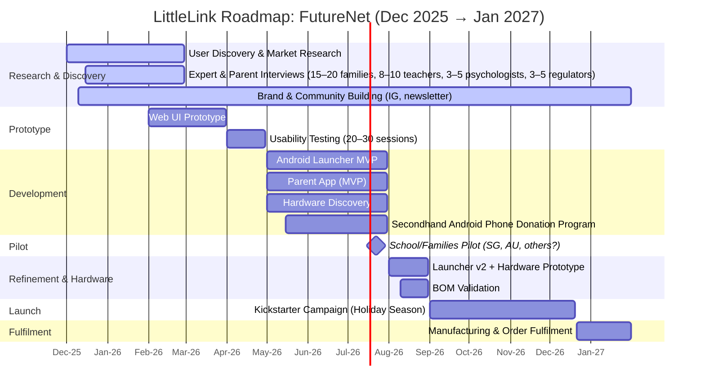

Gannt Chart

```mermaid
gantt
    title LittleLink Roadmap: FutureNet (Dec 2025 → Jan 2027)
    dateFormat  YYYY-MM-DD
    axisFormat  %b-%y

    section Research & Discovery
    User Discovery & Market Research      :active,      r1, 2025-12-01, 2026-02-28
    Expert & Parent Interviews (15–20 families, 8–10 teachers, 3–5 psychologists, 3–5 regulators) :active, r2, 2025-12-15, 2026-02-28
    Brand & Community Building (IG, newsletter)       :active, r3, 2025-12-10, 2027-01-31

    section Prototype
    Web UI Prototype                      :p1, 2026-02-01, 2026-03-31
    Usability Testing (20–30 sessions)    :p2, 2026-04-01, 2026-04-30

    section Development
    Android Launcher MVP                  :d1, 2026-05-01, 2026-07-31
    Parent App (MVP)                      :d2, 2026-05-01, 2026-07-31
    Hardware Discovery                    :d3, 2026-05-01, 2026-07-31
    Secondhand Android Phone Donation Program :d4, 2026-05-15, 2026-07-31

    section Pilot
    School/Families Pilot (SG, AU, others?) :milestone, pil1, 2026-07-15, 15d

    section Refinement & Hardware
    Launcher v2 + Hardware Prototype       :ref1, 2026-08-01, 2026-08-31
    BOM Validation                         :ref2, 2026-08-10, 2026-08-31

    section Launch
    Kickstarter Campaign (Holiday Season)   :launch1, 2026-09-01, 2026-12-20

    section Fulfilment
    Manufacturing & Order Fulfilment       :full1, 2026-12-21, 2027-01-31
```